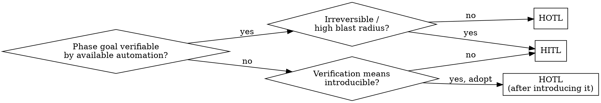

# Deciding Oversight Mode (HITL vs HOTL)

## Overview

**Oversight mode follows from verifiability.** If the goal of a piece of work can be checked by available automated means, the agent can run it and the human reviews the result (**HOTL**, human-on-the-loop). If it cannot, the human must approve as it goes (**HITL**, human-in-the-loop).

Two rules make this real:
- **Decide per phase, not per task.** Almost every task mixes modes (investigate / decide / implement / verify). Classify each phase on its own.
- **This skill STOPS at the judgment.** It produces a *judgment context* — the goal, the per-phase modes, and why — and hands off to the planning tool (Superpowers plan / OpenSpec / AI-DLC). It does not write the plan, commits, or PR.

## When to Use

- Before planning or coding, when handed an issue or a task description.
- When unsure how autonomous to let the agent be.
- When success is subjective/visual, the task is vague, or the change is hard to undo.

**Not for:** producing the implementation plan itself (that is the planning tool's job — hand off after this).

## The Procedure

1. **Refine the goal to a sufficient condition.** Restate the goal so that "goal met" ⟺ "issue/task satisfied", and so it is *checkable* (you can state a pass/fail condition). Refine the gap by:
   - **Searching** the issue's linked issues/PRs/dashboards and related topics for missing context.
   - **Asking the user** the minimum questions that close the remaining gap.
   Stop when the goal is a checkable sufficient condition. A goal you cannot make checkable is itself a signal (step 3).
2. **Split into phases.** Typical: investigate → decide/scope → implement → verify. Later steps classify each separately.
3. **Classify each phase by verifiability:**
   - Phase goal is verifiable by **available automated means** (tests, typecheck, CI, lint, scripts, metrics/dashboards) → **HOTL**.
   - Not verifiable, or existing means are insufficient (subjective/visual/taste, diagnosis, scoping) → **HITL**.
4. **Reversibility override.** If a phase does something irreversible or high-blast-radius (production, shared state, external send, unrecoverable deletes, a must-preserve invariant) → **HITL regardless of verifiability**.
5. **Reclassify via new verification.** If a phase is HITL *only because a verification means is missing but could be introduced* (a screenshot/visual-regression baseline, a benchmark, a metric assertion, a golden test), **propose introducing it**. If adopted and it makes the goal checkable → **reclassify that phase to HOTL** and lower the human's role to reviewing the result. Do not leave it as a human gate once the check exists.
6. **Emit the judgment context and STOP.** Write the output contract below to a handoff file, then hand off. Do not continue into planning or implementation.

## Output Contract (the judgment context)

State exactly these, in order. This is the whole deliverable:

- **Goal:** the refined, checkable sufficient condition.
- **Questions:** resolved (with answers) and any still open.
- **Phases:** a table — `phase | mode (HITL/HOTL) | why (verifiable-by-X / not-verifiable / irreversible) | gate (what the human approves, if HITL)`.
- **Proposed new verification:** the means to introduce (if any) and the reclassification it enables.
- **Handoff:** which planning tool takes this next (Superpowers plan / OpenSpec / AI-DLC).

Write it to a **handoff file outside the codebase** (a scratch/plan location, not tracked source) so the planning tool consumes it and the repo history stays clean.

## Per-Phase Decision

## Common Mistakes

- **Writing a full execution plan here** (worktree, commits, PR). STOP at the judgment context; planning is a separate tool. This is the most common failure.
- **Classifying the whole task as one mode.** Split into phases — most tasks are mixed (e.g. scope=HITL, implement=HOTL, visual check=HITL).
- **Treating "success is subjective" as permanently HITL** without asking whether a verification means could be introduced (step 5). Introducing a screenshot/benchmark often converts a human gate into an automated check.
- **Skipping goal refinement.** A vague goal is not verifiable, so everything collapses to HITL. Refine to a checkable condition first.
- **Leaving the goal un-checkable.** If you cannot state a pass/fail condition, you have not refined enough — or the phase is genuinely HITL. Say which.
