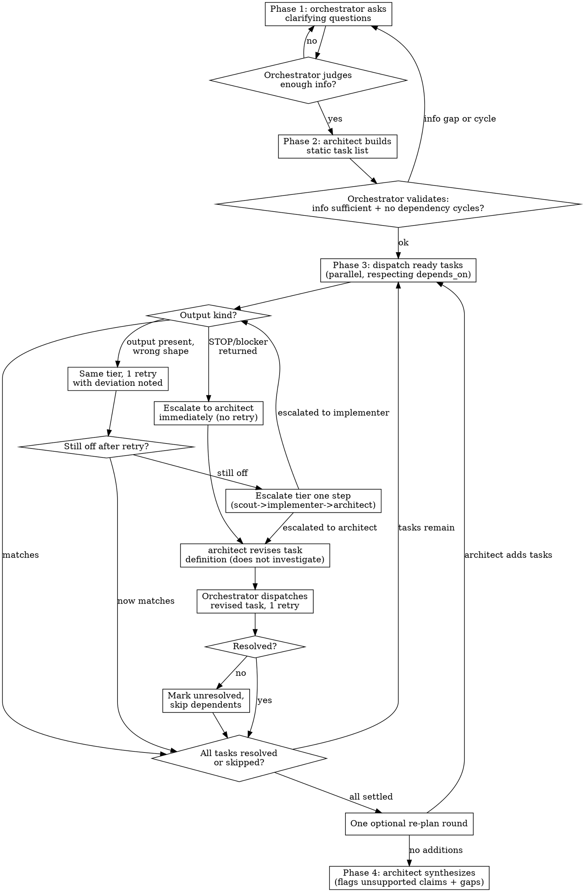

# Investigation

## Overview

Broad, deep, or ambiguous investigations fail when handled as one Read/Grep pass or one subagent dispatch — coverage gaps go unnoticed because nothing checks a sub-result against what was actually asked for. This skill runs a 4-phase orchestration: intake questions, a static task plan from `architect`, dispatch to `scout`/`implementer` with output-vs-task-definition checking and bounded escalation, and a final synthesis by `architect`.

**You (the main conversation) are the orchestrator.** You dispatch via the Agent tool by hand, phase by phase. Do not build this as a Workflow-tool script — Workflow requires its own per-invocation opt-in (`ultracode` or an explicit ask), and the core judgment here (does this output match the task definition?) is inspected turn-by-turn, which fights a pre-fixed script's control flow.

**`architect` never investigates.** Escalating to it gets you a task-definition fix or a "give up on this task" call — never a Read/Grep from architect itself. This keeps the existing `architect`/`scout`/`implementer` shared prompts untouched: `architect`'s own prompt says its job is judging results, not locating them.

## When to Use

- Invoked explicitly as `/investigation`. Do not self-trigger from description matching alone.
- Scope is broad (spans many files/subsystems), deep (needs layered follow-up), or ambiguous (the user hasn't pinned down what "done" looks like yet).

**Not for:** a single bug's root cause (`systematic-debugging`), a lookup in a repo you've already indexed (`code-memory`), or a search whose shape you can already state in one or two greps (just dispatch `scout` directly).

## The Flow

### Phase 1 — Intake (you)

Ask the user clarifying questions until you judge the goal and expected result are clear enough to hand to `architect`. No fixed number of rounds — this is a synchronous conversation with the user, not an unattended loop, so if it drags the user will redirect you. If `architect` later reports an information gap or a dependency cycle in the plan (Phase 2), bounce back here.

### Phase 2 — Plan (architect)

Dispatch `architect` to produce a **static** task list — generated once, up front. Do not let tasks accumulate mid-run outside the one optional re-plan round after Phase 3 (see below).

Each task:

| field | content |
|---|---|
| `id` | task identifier |
| `question` | the question this task must answer |
| `expected_output` | the output shape (e.g. `path:line` list, prose summary, comparison table) |
| `word_cap` | output word limit |
| `depends_on` | id of a task that must finish first (only if genuinely sequential) |

No `tier_hint` field — pick scout vs. implementer yourself at dispatch time per AGENTS.md's Model Routing (scout = shape known up front, implementer = judgment needed along the way). `scout` only holds Read/Grep/Glob — if the investigation isn't code-bound (external/web research, no local files to search), `scout` has nothing to work with; route everything to `implementer`.

Before dispatching anything, validate the plan yourself: check `depends_on` for cycles. A cycle, or a gap `architect` flags as missing information, sends you back to Phase 1 — not a self-fix.

### Phase 3 — Execute, check, escalate (you, then architect on escalation)

Dispatch every task with no unmet `depends_on` in one message (parallel — AGENTS.md's "Default to parallel"). Dispatch dependents only once their prerequisite resolves.

Before that first parallel dispatch, sanity-check anything all the tasks will share (an unusual tool, a path, an assumption about the environment). If it's broken, every task discovers it independently and you pay for the failure N times instead of once. One check now is cheaper than N identical escalations later.

Tell every dispatched subagent, as part of the prompt: if a tool errors or returns empty, report the command and its raw output rather than concluding what it means. A subagent cannot tell its own tool failing apart from the thing it was asked about not existing — "directory not found" and "my search tool is broken" look identical from inside a failed call, and only you hold the context (e.g. you already confirmed the path exists) to tell them apart.

When a result comes back, read it against `question`/`expected_output`/`word_cap` and sort it into exactly one of two buckets:

1. **Wrong shape** (there's an answer, it just doesn't fit): re-dispatch **once**, same tier, same task definition, with the specific deviation spelled out in the prompt. Still wrong → escalate the tier **one step** (scout → implementer → architect). Do not jump scout straight to architect — AGENTS.md's "one interface at a time" rules out skipping a rung.
2. **Blocker returned** (the subagent used its own STOP convention — judgment needed, edit needed, wrong premise): skip the same-tier retry entirely — the task definition itself is the problem, not the execution — and escalate straight to `architect`.

   Treat the blocker's *stated* cause as a symptom, not a fact. A subagent reporting "this doesn't exist" may really mean "my tool broke" — verify the claim against what you already know before passing it to `architect`, and hand `architect` the verified facts (not the subagent's raw self-diagnosis) alongside the task. `architect` may conclude the real fix is a tier change, not a reworded question — that's still it doing its one job (judging what's wrong with the task as given), not it investigating.

**Once `architect` is in the loop for a task, it only edits the task definition** (splits it, rewords `question`/`expected_output`, whatever closes the gap) and hands it back. You dispatch the revised task **once**. Still unresolved → `architect` does not take over and investigate; you mark the task unresolved and skip anything that depended on it. Cycle detection and this skip-propagation are your job (the orchestrator's), not `architect`'s.

**Optional re-plan round:** once every task is resolved or skipped, give `architect` one — and only one — chance to propose additional tasks the run surfaced. If it does, run them through this same Phase 3 process; don't offer a second re-plan round. If the user needs more after that, they re-invoke `/investigation`.

### Phase 4 — Synthesize (architect)

`architect` produces one integrated summary answering the user's actual question. It must:

- Flag any claim not directly backed by a cited `path:line` (or equivalent) as uncertain — a shape-matching output is not the same as a correct one.
- Name any task left unresolved, and anything skipped because it depended on one, as an explicit gap.

It must **not** include the reject/retry/escalation play-by-play — that's process noise, not the answer.

Keep the output in the chat response. This skill never writes files to the repo.

## Non-Goals

- Wiring this into the Workflow tool. A future ultracode/workflow opt-in could run this plan as a script, but that's a separate piece of work.
- Unbounded dynamic task addition — capped at the one re-plan round in Phase 3.
- Changing the `architect`/`scout`/`implementer` shared prompts. If `architect` ever needs to Read/Grep to escalate a task, that's a sign this skill's design is wrong, not a reason to loosen that prompt.

## Common Mistakes

- Skipping straight from scout to architect on a wrong-shape retry failure — go through implementer first.
- Retrying a blocker-returning task at the same tier — the STOP means the definition is broken; retrying just burns a round for nothing.
- Letting `architect` "just quickly check" something during escalation — that is investigating, and it isn't `architect`'s job here.
- Including per-task reject/retry history in the Phase 4 summary — the user wants the answer, not the process.
- Taking a blocker's stated reason at face value when you already have contradicting information — a subagent cannot distinguish its own tool breaking from the thing it searched for not existing.
- Letting several parallel tasks each independently discover the same environment problem instead of checking it once up front.
